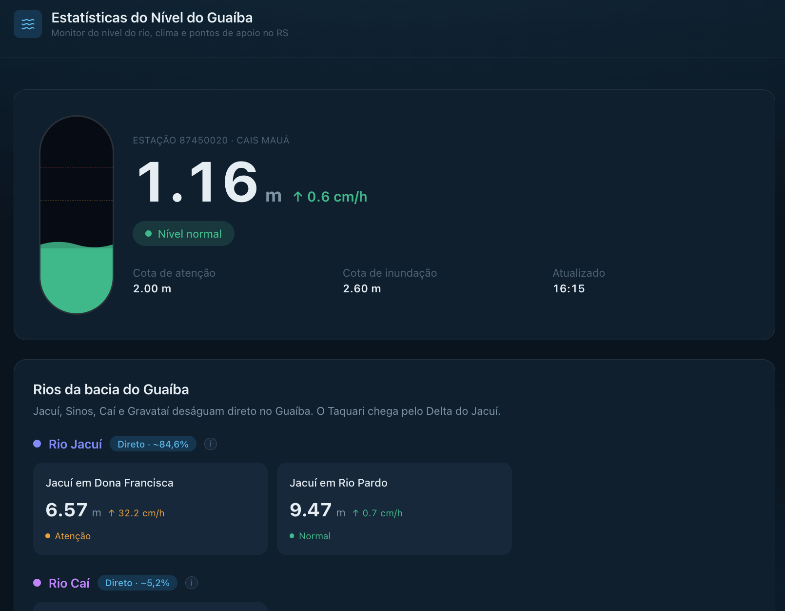
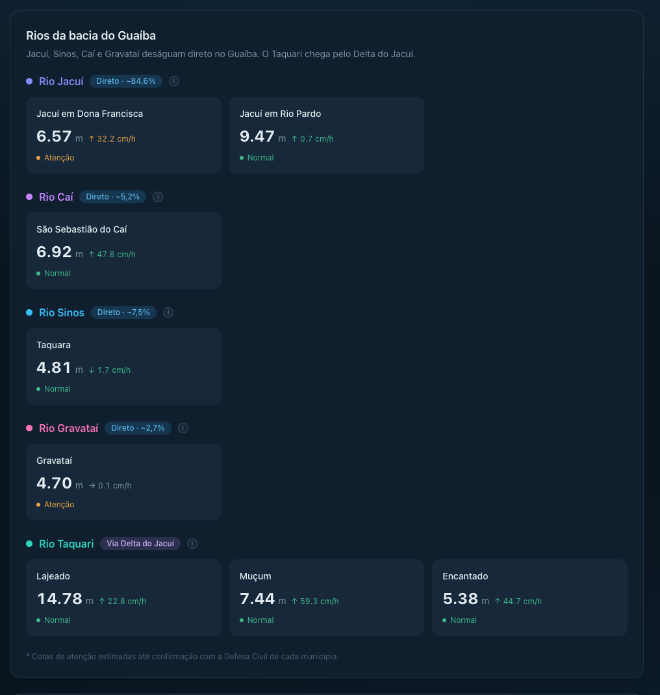
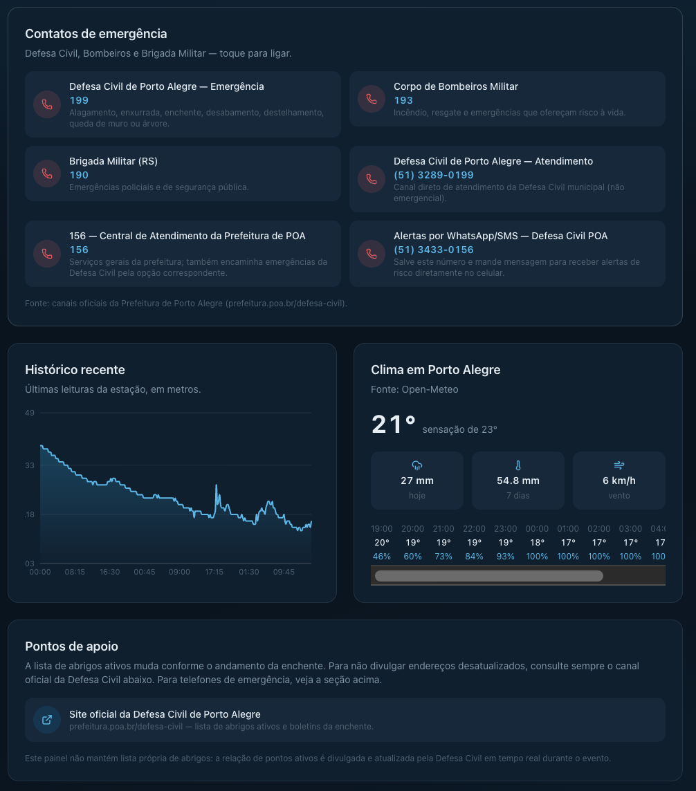
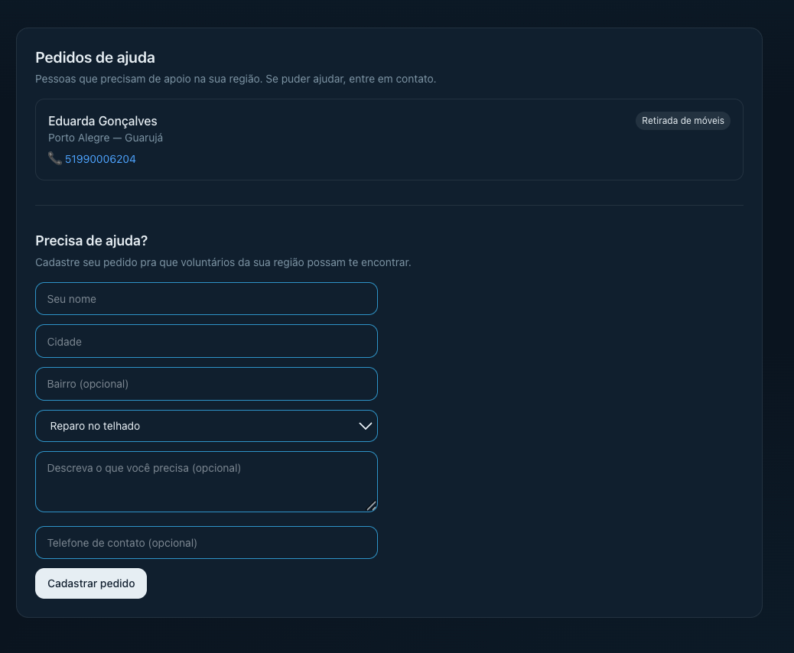

# estatisticas-nivel-guaiba

Painel em tempo real do nível do rio Guaíba, previsão do tempo, pontos de apoio e pedidos de ajuda em Porto Alegre/RS, feito no contexto das enchentes que atingem o estado, para ajudar quem precisa acompanhar a situação rapidamente e conectar quem precisa de ajuda com quem pode ajudar.


## Prévia do painel

<p float="left">
  
  
</p>
<p float="left">
  
  
</p>

## O que o painel mostra

- **Nível do Guaíba** — leitura atual, tendência (subindo/descendo) e
  histórico recente, comparados às cotas de atenção e inundação.
- **Clima de Porto Alegre** — temperatura, chuva prevista para hoje e para
  os próximos 7 dias, vento.
- **Contatos de emergência** — Defesa Civil, Bombeiros e Brigada Militar,
  com números clicáveis para ligar direto.
- **Pontos de apoio** — não mantém lista própria; direciona para o canal
  oficial da Defesa Civil, que atualiza abrigos ativos em tempo real
  durante o evento.
- **Pedidos de ajuda** — pessoas cadastram o que precisam (reparo, retirada
  de móveis, doação, transporte etc.) por cidade/bairro, e voluntários
  podem ver e entrar em contato.

## Stack

- **Next.js 15** (App Router) + **TypeScript** — front-end e API routes no
  mesmo projeto, deploy direto na Vercel.
- **Tailwind CSS v4** para estilo, com um sistema de tokens de design
  próprio (`src/app/globals.css`) em vez do tema padrão.
- **Recharts** para o gráfico de histórico.
- **fast-xml-parser** para ler a resposta XML do serviço da ANA.
- **Supabase (PostgreSQL)** para persistência dos pedidos de ajuda.

## Fontes de dados

| Dado | Fonte | Autenticação |
|---|---|---|
| Nível do rio | [ANA — Hidrotelemetria](https://www.ana.gov.br/hidrowebservico) (estação Cais Mauá, código `87450020`) | Nenhuma (serviço público) |
| Clima | [Open-Meteo](https://open-meteo.com/) | Nenhuma |
| Contatos de emergência | `src/data/contatos-emergencia.json` | — |
| Pontos de apoio (abrigos) | Canal oficial da Defesa Civil ([prefeitura.poa.br/defesa-civil](https://prefeitura.poa.br/defesa-civil)) — não mantido pelo painel | — |
| Pedidos de ajuda | Supabase (tabela `solicitacoes_ajuda`) | Chave anon (ver `.env.local`) |

## API

### `GET /api/solicitacoes`
Lista todos os pedidos de ajuda, mais recentes primeiro.

### `POST /api/solicitacoes`
Cria um novo pedido de ajuda.

**Body:**
```json
{
  "nome": "string (obrigatório)",
  "cidade": "string (obrigatório)",
  "bairro": "string (opcional)",
  "tipo_ajuda": "string (obrigatório)",
  "descricao": "string (opcional)",
  "telefone": "string (opcional)"
}
```

### `PUT /api/solicitacoes/[id]`
Atualiza um pedido de ajuda existente (ex: mudar status para "atendido").

## Variáveis de ambiente

Crie um `.env.local` na raiz com:
NEXT_PUBLIC_SUPABASE_URL=sua_url_do_projeto_supabase
NEXT_PUBLIC_SUPABASE_ANON_KEY=sua_chave_anon_public

## Rodando localmente

```bash
npm install
npm run dev
```

Abra [http://localhost:3000](http://localhost:3000).

## Testes

```bash
npm test
```

## Nota técnica

**Por que Supabase:** já uso essa stack no dia a dia, e resolve persistência
+ API instantânea sem precisar subir e manter um banco à parte — bom
equilíbrio entre velocidade de desenvolvimento e robustez para um projeto
que ainda está validando seu formato final.

**Trade-off consciente — RLS aberta:** as policies de Row Level Security da
tabela `solicitacoes_ajuda` liberam select/insert/update para o role `anon`,
sem autenticação. Essa é uma decisão temporária para a fase atual do
projeto — antes de qualquer divulgação pública real, isso precisa mudar
para exigir autenticação na criação/edição de pedidos e restringir updates
de status a voluntários verificados.

**Melhorias planejadas:**
- Autenticação (ex: Supabase Auth) para diferenciar quem pede ajuda de quem
  se voluntaria, e permitir moderação de conteúdo.
- Mapa (Leaflet/Mapbox) para visualizar pedidos e pontos de apoio
  geograficamente, não só em lista.
- Migrar `abrigos.json` para o Supabase também, para atualização sem
  redeploy.
- Paginação/filtro por cidade nos pedidos de ajuda, à medida que o volume
  crescer.
- Rate limiting no endpoint de POST para evitar spam/abuso.

## Limitações conhecidas

1. **Endpoint da ANA ainda não validado em produção.** Este projeto foi
   desenvolvido num ambiente sem acesso direto à rede da ANA, então a
   integração em `src/lib/ana.ts` ainda não foi testada contra o serviço
   real. Para validar:
```bash
   curl "http://telemetriaws1.ana.gov.br/ServiceANA.asmx/HidroSerieHistorica?codEstacao=87450020&dataInicio=01/01/2026&dataFim=31/12/2026&tipoDados=3&nivelConsistencia=1"
```
   e ajustar `parseRespostaAna()` conforme a estrutura real do XML.

2. Cotas de atenção/inundação em `src/lib/ana.ts` estão com valores de
   referência e precisam ser confirmadas com a Defesa Civil.

## Roadmap

- [ ] Validar e ajustar o parsing do XML da ANA com dados reais
- [ ] Mapa (Leaflet/Mapbox) para pedidos de ajuda
- [ ] Autenticação para voluntários e moderação de pedidos
- [ ] Alertas por bairro usando os dados abertos da Prefeitura de POA
      ([dadosabertos.poa.br](https://dadosabertos.poa.br))
- [ ] Status de "atendido" nos pedidos de ajuda, para acompanhar quais já
      foram resolvidos

## Por que este projeto

Feito num momento em que o Rio Grande do Sul segue lidando com o risco de enchentes recorrentes. A ideia não é substituir os canais oficiais da Defesa Civil, mas oferecer uma visão rápida e acessível de dados que já são públicos, e conectar quem precisa de ajuda com quem pode ajudar.
